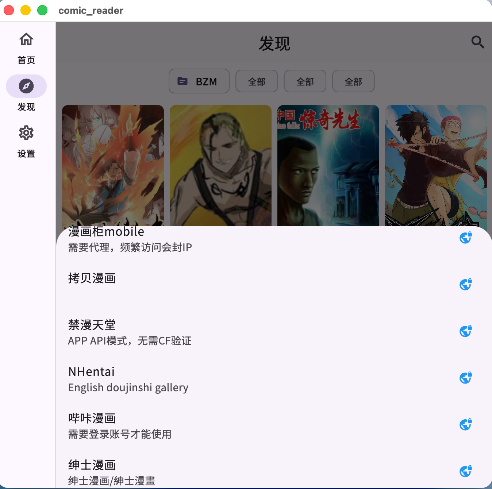
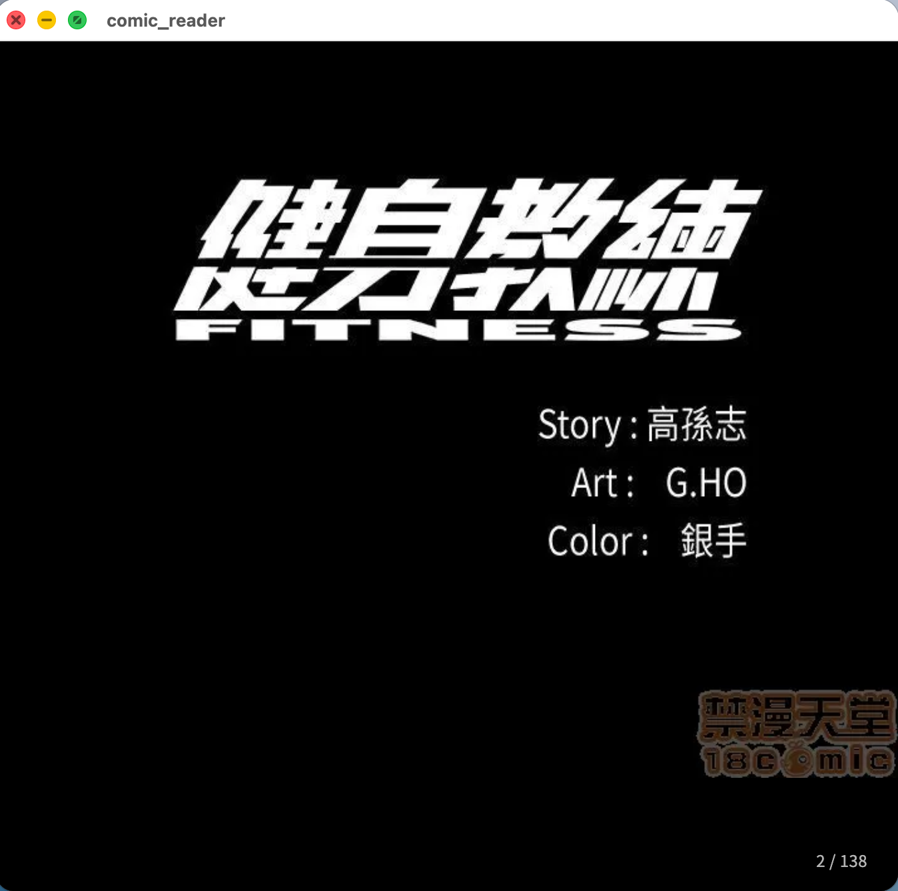
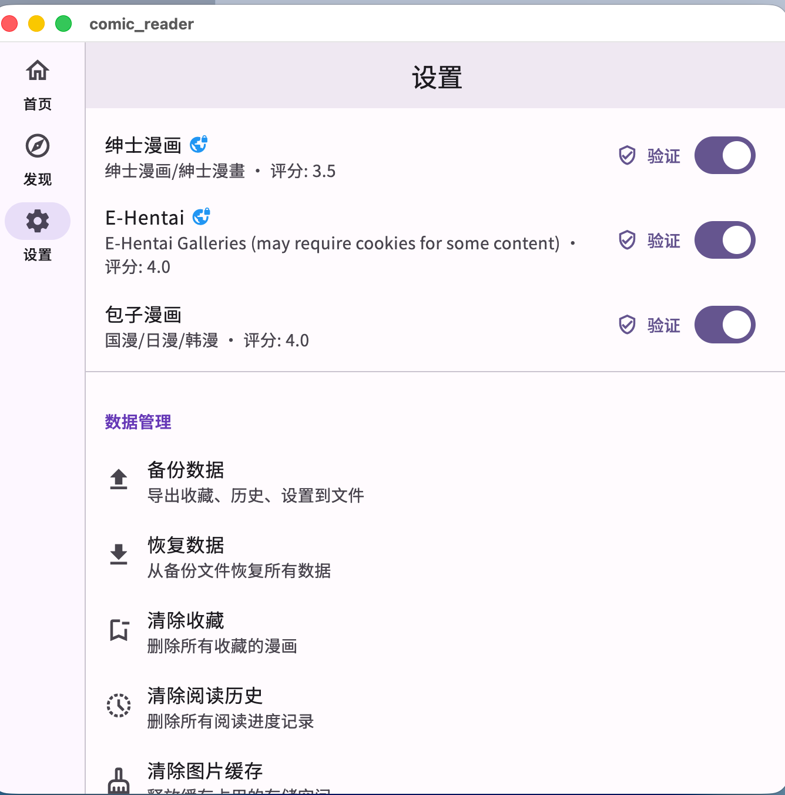

# Comic Reader

<p align="center">
  
</p>

<p align="center">
  <b>多源聚合漫画阅读器</b><br>
  支持 macOS / iOS / Android / Web 多平台
</p>

<p align="center">
  
  
  
</p>

---

## 功能特性

### 多源聚合

| 源 | 说明 | 特殊要求 |
|----|------|---------|
| 包子漫画 | 国漫/日漫/韩漫 | - |
| 拷贝漫画 | 综合漫画 | 科学上网 |
| E-Hentai | E-Hentai Galleries | 科学上网 |
| 禁漫天堂 | APP API 模式 | 无需 CF 验证, 科学上网 |
| 漫画柜 | 综合漫画 | 科学上网 |
| NHentai | English doujinshi | 科学上网 |
| 哔咔漫画 | 需账号登录 | Email/Password内置 |
| 绅士漫画 | 紳士漫畫 | 需 Cloudflare 验证 |

### 阅读体验

- 全屏沉浸式阅读器
- 横向翻页模式（支持 LTR/RTL）
- 纵向滚动模式（Webtoon 风格）
- 自动翻页（2-15 秒间隔可调）
- 阅读进度自动记录与恢复

### 收藏与管理

- 收藏书架 + 新章节更新提示
- 章节下载（离线阅读）
- 跨源搜索
- 数据备份/恢复（JSON 导出）

### 设置与个性化

- 主题：浅色 / 深色 / AMOLED / 跟随系统
- 网络代理配置
- 插件启用/禁用管理

---

## 截图

| 书架 | 书架2 | 发现 |
|:----:|:-----:|:----:|
|  |  |  |

| 详情 | 详情2 | 设置 |
|:----:|:-----:|:----:|
|  |  |  |

---

## 安装

### 方式一：下载 Release（推荐）

前往 [Releases](../../releases) 页面下载对应平台安装包：

| 平台 | 文件 | 要求 |
|------|------|------|
| macOS | `ComicReader-x.x.x-macOS.dmg` | macOS 11.0 (Big Sur)+ |
| Windows | `ComicReader-x.x.x-Windows.zip` | Windows 10+ |

#### macOS 安装说明

1. 双击 `.dmg` 文件
2. 将 app 拖到 Applications 文件夹
3. **首次打开**（重要）：右键点击 app → 打开 → 弹出警告点"打开"
4. 或终端执行：
   ```bash
   xattr -cr /Applications/comic_reader.app
   ```

#### Windows 安装说明

1. 解压 `.zip` 到任意目录
2. 双击 `comic_reader.exe` 运行

### 方式二：从源码编译

#### 环境要求

- [Flutter SDK](https://docs.flutter.dev/get-started/install) 3.11+
- Xcode 15+（macOS/iOS）
- Android Studio（Android）

#### 编译运行

```bash
# 克隆项目
git clone https://github.com/achui1980/comic-reader.git
cd comic-reader

# 安装依赖
flutter pub get

# 生成代码（依赖注入等）
dart run build_runner build --delete-conflicting-outputs

# 运行（macOS）
flutter run -d macos

# 运行（iOS 真机）
flutter run -d <device-id>

# 运行（Android）
flutter run -d <device-id>

# 运行（Web - 需要 CORS 代理）
./tools/run_web.sh
```

#### 打包 macOS DMG

```bash
# 安装 create-dmg
brew install create-dmg

# 一键打包
./tools/build_dmg.sh
```

产物：`build/dmg/ComicReader-x.x.x.dmg`

---

## 项目结构

```
lib/
├── app/
│   ├── di/                 # 依赖注入（GetIt + Injectable）
│   └── router/             # 路由（GoRouter）
├── data/
│   ├── local/              # 本地存储（收藏、历史、设置）
│   ├── remote/             # 网络层（Dio、拦截器、代理）
│   ├── repositories/       # 数据仓库实现
│   └── sources/            # 漫画源插件
│       ├── manga_source.dart   # 抽象基类
│       ├── baozi_manga.dart    # 包子漫画
│       ├── copy_manga.dart     # 拷贝漫画
│       ├── ehentai.dart        # E-Hentai
│       ├── jm_comic.dart       # 禁漫天堂
│       ├── nhentai.dart        # NHentai
│       ├── pica_comic.dart     # 哔咔漫画
│       └── wnacg.dart          # 绅士漫画
├── domain/
│   ├── entities/           # 领域实体
│   └── repositories/       # 仓库接口
└── presentation/
    ├── home/               # 书架首页
    ├── discovery/          # 发现页
    ├── search/             # 搜索页
    ├── detail/             # 漫画详情
    ├── reader/             # 阅读器
    ├── settings/           # 设置
    └── downloads/          # 下载管理
```

---

## 网络与代理

本应用部分漫画源需要代理才能访问。在设置中配置代理地址（格式：`host:port`）。

### Cloudflare 验证

部分源（如绅士漫画）有 Cloudflare 保护：
1. App 会自动检测并弹出验证提示
2. 点击"去验证"进入 WebView 完成人机验证
3. 验证通过后 Cookie 自动保存，后续请求自动携带

### Web 平台

Web 端由于浏览器跨域限制，需要本地 CORS 代理：

```bash
# 启动代理 + Web 服务
./tools/run_web.sh
```

---

## CI/CD

项目使用 GitHub Actions 自动构建发布：

- **触发条件**：推送 `v*` tag 或手动触发
- **产物**：macOS DMG + Windows zip
- **发布**：自动上传到 GitHub Releases

```bash
# 发布新版本
git tag v1.0.1
git push --tags
```

---

## 技术栈

| 类别 | 技术 |
|------|------|
| 框架 | Flutter 3.11+ / Dart |
| 状态管理 | flutter_bloc / Cubit |
| 导航 | GoRouter |
| 网络 | Dio |
| 依赖注入 | GetIt + Injectable |
| HTML 解析 | html (dart) |
| 加密 | PointyCastle / Encrypt |
| 图片 | CachedNetworkImage / ExtendedImage |
| WebView | flutter_inappwebview |

---

## 许可证

MIT License
